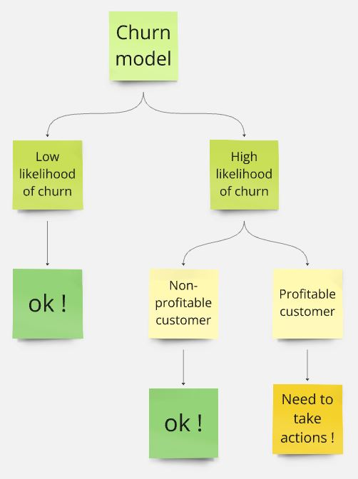

# Churn Probability Calculator App

This application is running on **Render**: https://bank-churn-ml.onrender.com

The **mainpage** of this app looks like the image below !

**Note**: The app might not be working as there is a usage limit for Free tier on **Render**.

## Context

- **Project context:** I wanted to work on a real **Data Science** project in order to deepen my understanding of commonly used DS libraries such as mlflow, sklearn and FastAPI. 

- **Business context:** My manager identified that the company´s **churn rate** was roughly **20%** and asked me to **propose measures** to help reduce this percentage.

## Goal

- **Project goal:** Become familar with libraries often used in a DS project (sklearn, mlflow, Fastapi) and gain practical experience by applying them.

- **Business goal:** Develop **ideas** to reduce the churn rate and **propose measures**.

## Structure and flow

This project consists of 5 main steps:

- **Preprocessing / EDA**: Import, clean and visualize the data using pandas and matplotlib to get patterns and insights. 

- **Modelling**: Build and train machine learning models using scikit-learn and optimize the workflow with mlflow.

- **Application**: Develop a user-friendly app that allows users to predict the churn probability for:
    - **One specific client**: manually input client data (predict_single page) 
    - **Multiple clients**: Upload a csv file containing the required columns (predict_batch page). Users can download the .csv file containing the churn probability.

- **API**: Create a simple API that returns the churn probability based on the input data.

- **Deployment**: Deploy the Streamlit application for easy access and use.

## Results

- The model using **Random Forest Classifier** was selected as the most appropriate in this case based on 3 reasons:
    - There were **no signs of overfitting or underfitting** and it has a good generalization performance.
    - The **accuracy, F1 score and the Area under the ROC curve** was the **highest** amongst the models used.
    - The percentage of **False Negative** and **False Positive** were **lower** than other models (on the right size in the image):
        - 46% classified as True Negative
        - 49% classified as True Positive
        - 1,1% classified as False Negative
        - 4,4% classified as False Positive

    
    Confusion matrix showing the performance of each model in %

## Analysis

- Before we think about measures to take so as to reduce the churn rate, I broke this problem into small parts:

    

    - **Scenario 1:** The clients which have **low likelihood of churn** are not a problem here because the main goal is to reduce churn.

    - **Scenario 2:** The clients which have **high likelihood of churn and are not profitable** have limited impact on the revenue of the company. For this reason, I considered ok here.

    - **Scenario 3:** The clients which have **high likelihood of churn and are profitable** have a huge financial impact on the company.

    - The table might look like:

        |  | Profitable customer | Non-profitable customer |
        | -------- | -------- | -------- |
        | **High prob. churn** | **Need actions !** | ok !| 
        | **Low prob. churn** | ok ! | ok ! | 

    
    -  The **criterion** for **likelihood** and **profitable** varies for each company and should be evaluated carefully with your manager.

- **Measures** that can be taken for **scenario 3**:
    - **Step 1: Understand the reason of churn**
        - Customer Insights: Analyze customer behavior patterns through data (purchase history, customer service interactions, etc.) to understand early signals of churn. Follow up with direct customer engagement (phone calls, emails) to gather qualitative insights on why they are leaving.
    - **Step 2: Engage with them**
        - Personalized Engagement: Deliver targeted content such as special offers, lifecycle updates, or promotions based on each customer’s individual preferences and past behaviors. Personalization can increase customer retention by showing that the company understands their needs.
        - Ask for feedbacks to identify problems and improve user experice
    - **Step 3: Offer incentives**
        - Offer rewards programs or loyalty points to customers who engage with your business again. This can help foster long-term relationships and prevent future churn.

## Improvements

1. Churn Definition:

    - **Details of Churn:** The current analysis lacks a clear definition of churn, such as whether it's involuntary (e.g., account closures due to non-payment) or voluntary (e.g., customers leaving by choice).
    - **Information on datetime:** It is challenging to get the churn rate in this case as there is no information on datetime. Usually, churn rate is given by dividing the number of churns by the number of customers at the begging of a specific time (can be week, month or year).

2. Business Model Information:

    - **Lack of Context on Revenue:** There is no information regarding how the bank generates revenue, which is crucial for creating retention strategy. Understanding the bank's business model would help in analyzing which customers are truly profitable and how their churn affects overall revenue.

3. Data Infrastructure:

    - **Lake of Analytical Database**: Currently, the analysis relies on CSV files for input, which is not optimal for larger-scale data analysis. Instead, connecting to an analytical database (e.g., a data warehouse) would be more efficient as they are better suited for analysis and reporting.
    

## Sources:

- https://www.superoffice.com/blog/reduce-customer-churn/
