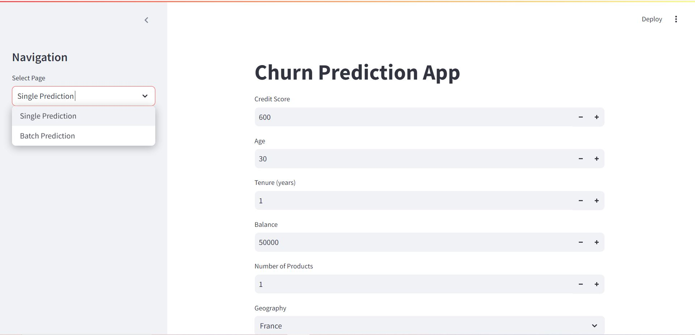
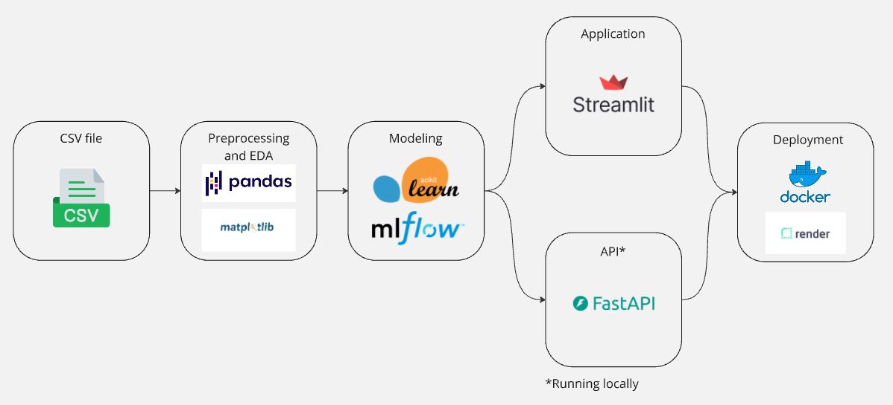
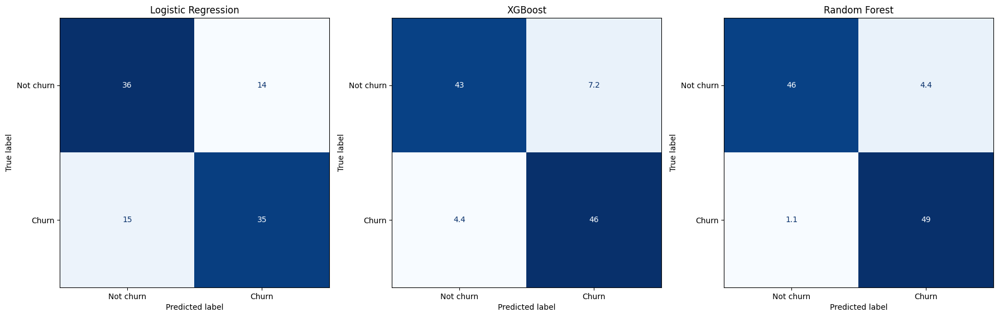

# Churn Probability Calculator App

This application is running on **Render**: https://bank-churn-ml.onrender.com

The **mainpage** of this app looks like the image below !

**Note**: The app might not be working as there is a usage limit for Free tier on **Render**.

## Context

- **Project context:** I wanted to work on a real **Data Science** project in order to deepen my understanding of commonly used DS libraries such as mlflow, sklearn and FastAPI. 

- **Business context:** My manager identified that the company´s **churn rate** was roughly **20%** and asked me to **propose measures** to help reduce this percentage.

## Goal

- **Project goal:** Become familar with libraries often used in a DS project (sklearn, mlflow, Fastapi) and gain practical experience by applying them.

- **Business goal:** Develop **ideas** to reduce the churn rate and **propose measures**.

## Structure and flow

This project consists of 5 main steps:

- **Preprocessing / EDA**: Import, clean and visualize the data using pandas and matplotlib to get patterns and insights. 

- **Modelling**: Build and train machine learning models using scikit-learn and optimize the workflow with mlflow.

- **Application**: Develop a user-friendly app that allows users to predict the churn probability for:
    - **One specific client**: manually input client data (predict_single page) 
    - **Multiple clients**: Upload a csv file containing the required columns (predict_batch page). Users can download the .csv file containing the churn probability.

- **API**: Create a simple API that returns the churn probability based on the input data.

- **Deployment**: Deploy the Streamlit application for easy access and use.

## Results

- The model using **Random Forest Classifier** was selected as the most appropriate in this case based on 3 reasons:
    - There were **no signs of overfitting or underfitting** and it has a good generalization performance.
    - The **accuracy, F1 score and the Area under the ROC curve** was the **highest** amongst the models used.
    - The percentage of **False Negative** and **False Positive** were **lower** than other models (on the right size in the image):
        - 46% classified as True Negative
        - 49% classified as True Positive
        - 1,1% classified as False Negative
        - 4,4% classified as False Positive

    
    Confusion matrix showing the performance of each model in %

- 

## Improvements
    
- churn (no info on time)

